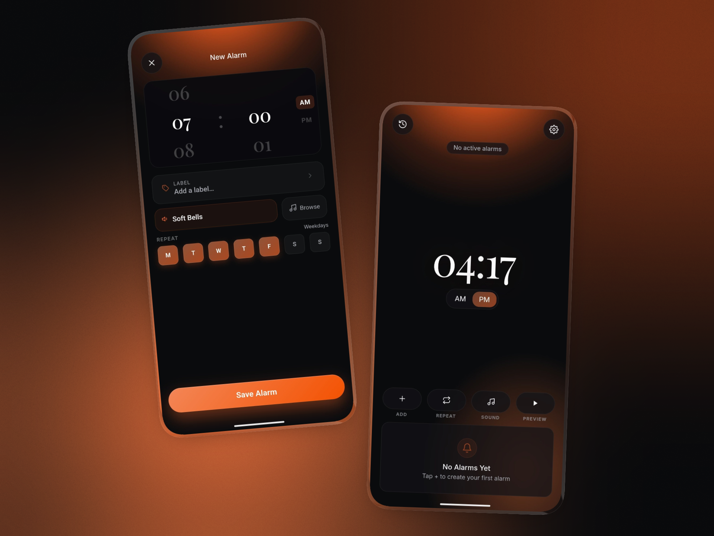
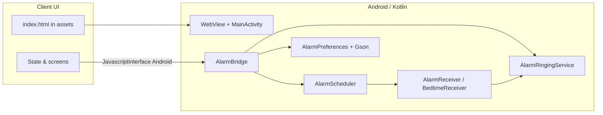

# Vibe Alarm

<p align="center">
  <b>Sync with the sun — wake up beautifully.</b><br/>
  A calm, minimalist alarm for Android. Dark UI, soft gradients, and native reliability under the hood.
</p>

<p align="center">
  <a href="LICENSE"></a>
  
  
  
</p>

<p align="center">
  
</p>

---

## Why it exists

Most stock and third-party alarm apps are noisy: ads, bloat, or a UI that fights you before your first coffee. **Vibe Alarm** keeps the job simple: **wake you on time** with a UI that feels intentional—more morning ritual, less siren. The product surface is a **WebView**-hosted experience for fast iteration and a cohesive visual language; **scheduling, audio, and system integration stay native** so alarms behave like real alarms on modern Android.

---

## Features

| Area | What you get |
|------|----------------|
| **Alarms** | Create & edit, flexible schedules, one-off alarms, large dashboard clock |
| **Sound & haptics** | Custom sounds, vibration presets (Pulse, Ripple, Storm, …) |
| **Snooze** | Deferred wake with a dedicated scheduling path and cancel path |
| **History** | Fires, snoozes, and dismissals at a glance |
| **Bedtime** | A gentle *wind-down* nudge (notification channel) before your next wake |
| **After reboot** | `BootReceiver` rehydrates the schedule from persisted state |
| **Lock screen** | `MainActivity` is eligible for `showWhenLocked` / `turnScreenOn` so the alarm is visible immediately |

**UX:** edge-to-edge layout, `safe-area` for notches and gesture bars, deep canvas `#0A0B0D`, accent `#FF6A2A`, Inter + Playfair typography.

---

## Tech stack

- **UI:** `WebView` + `assets/index.html` (vanilla HTML/CSS/JS, single-file app shell)
- **Native:** Kotlin, `AlarmManager` pipeline, `AlarmReceiver` / `BootReceiver` / `BedtimeReceiver`, `AlarmRingingService` (foreground `mediaPlayback`)
- **Bridge:** `JavascriptInterface` named `Android` — persist JSON state, schedule/cancel, snooze, notifications permission flow, haptic previews
- **Data:** `AlarmPreferences` + Gson JSON payload; state hydrated on cold start and synced back on changes

---

## Architecture



**Android 12+ notes:** the app nudges users toward **exact alarm** and **full-screen intent** settings when the OS requires them. **Post notifications** are requested from the in-app flow (not cold-launch spam).

---

## Download

**[→ Vibe Alarm v1.0 — latest APK on GitHub Releases](https://github.com/TUHS-lab/Vibe-Alarm/releases/tag/v1.0)**

1. On that page, under **Assets**, download the `.apk` file.  
2. Open it on your phone and install; if prompted, allow installation from that source (browser, Files, etc.).

---

## Build from source

Use this if you are developing or prefer to compile locally. End users can ignore this and use [Download](#download) instead.

| Requirement | Version |
|-------------|---------|
| JDK | 17 |
| `compileSdk` / `targetSdk` | 34 |
| `minSdk` | 26 |

```bash
# Debug APK
./gradlew assembleDebug        # macOS / Linux
gradlew.bat assembleDebug     # Windows
```

Output: `app/build/outputs/apk/debug/`

Install to a connected device:

```bash
./gradlew installDebug
# or
gradlew.bat installDebug
```

Open the `app` module in **Android Studio** for debugging and layout inspection of native chrome.

---

## Permissions (why they’re there)

Vibe Alarm asks for the privileges you expect from a **real** alarm app: `SCHEDULE_EXACT_ALARM` / `USE_EXACT_ALARM`, `USE_FULL_SCREEN_INTENT`, `FOREGROUND_SERVICE` + `FOREGROUND_SERVICE_MEDIA_PLAYBACK`, `POST_NOTIFICATIONS` (API 33+), `RECEIVE_BOOT_COMPLETED`, `VIBRATE`, `WAKE_LOCK`, plus `INTERNET` (e.g. web fonts in the WebView). Nothing exotic—just what keeps fires accurate and visible.

---

## Repository layout

```
app/src/main/
├── assets/
│   └── index.html      # All UI and client logic
├── java/com/vibealarm/ # MainActivity, bridge, scheduler, receivers, service
└── res/                # Theme, strings, launcher icons
```

---

## Troubleshooting

If alarms are late or silent, check **battery optimization** (don’t restrict this app) and system **Alarms & reminders** / **exact alarm** access. OEM skins vary; those two settings fix most “it didn’t go off” reports.

---

## License

[MIT](LICENSE) © 2026 TUHS

---

<p align="center">
  <sub>Built with a small native core and a big focus on how mornings should feel.</sub>
</p>
